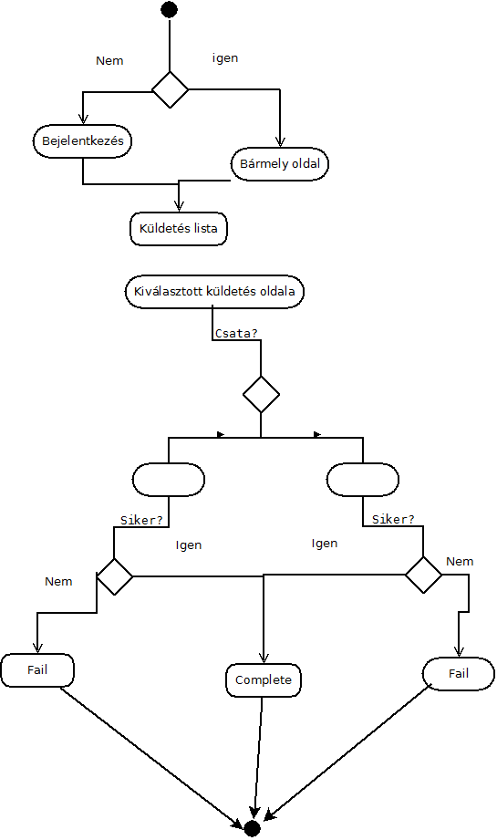
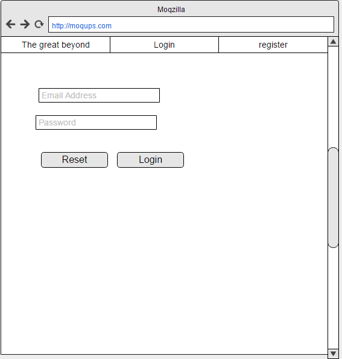
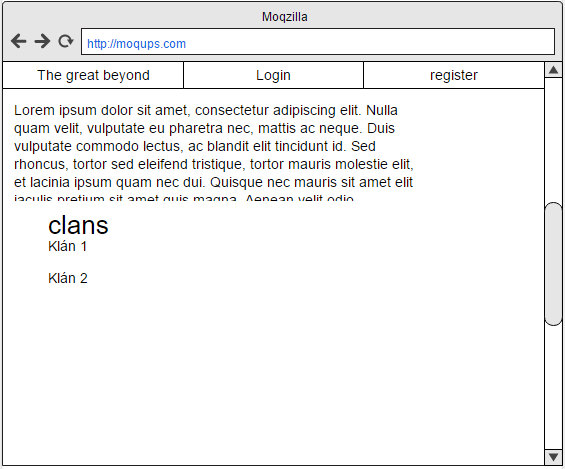
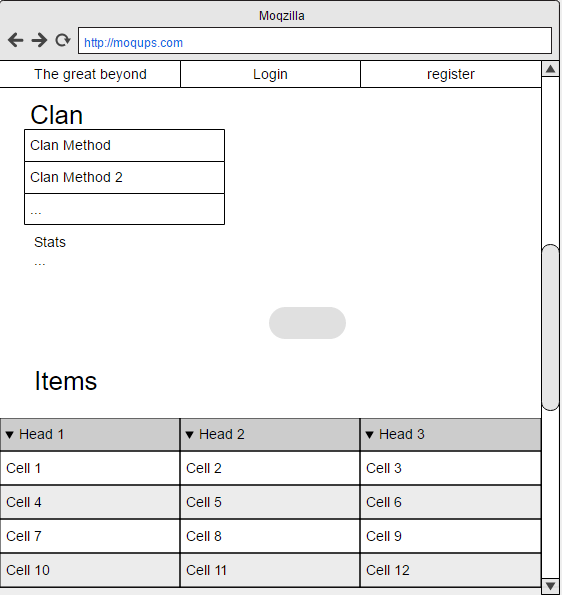
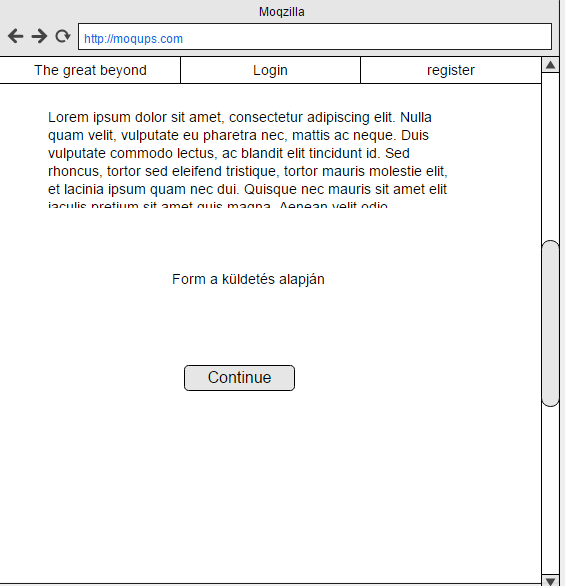
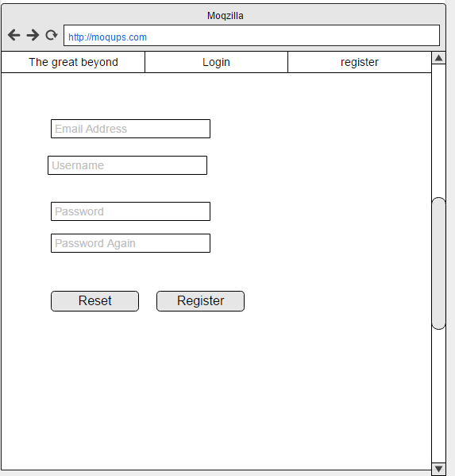
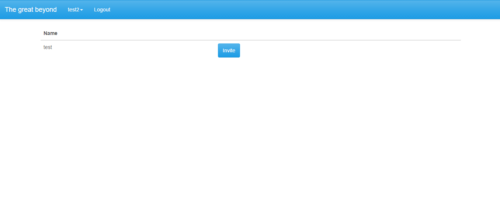
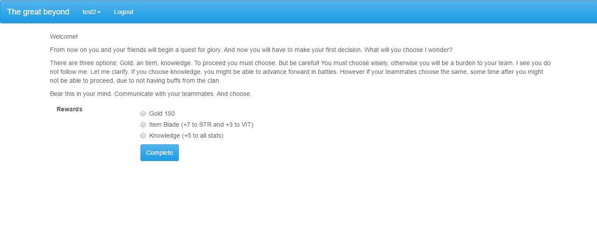
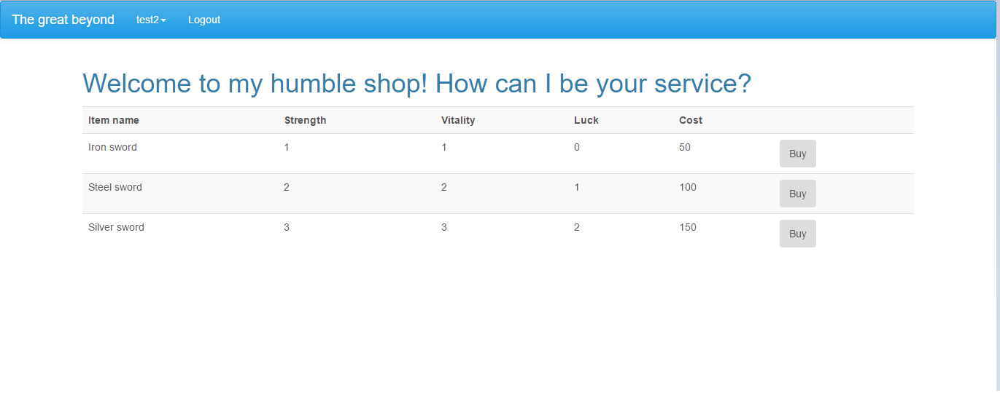
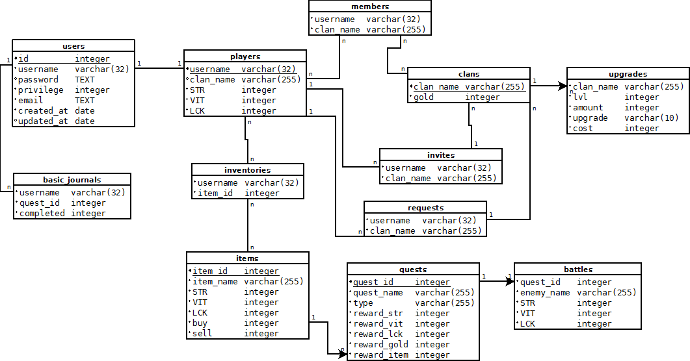

# Alkalmazások fejlesztése - 2. beadandó 

## 0. Kis bevezető (Szerveroldal)

A program egy nagyon egyszerű kis többszemélyes játék. A játék arról szól hogy a különböző küldetésekben végül ki jut el a legvégéig.
A klánok szükségesek ahhoz hogy a vége felirathoz eljussanak az egyes játékosok. Jelenleg a vége még nincs implementálva ugyanis
azt a kliensoldali megoldásokkal lehetséges szépen megoldani.

A jelenlegi beállításokkal lehet tesztelni az alapműveletek. Később majd jó szórakozást a játékhoz.

## 1. Követelményanalízis

### 1.1 Követelmények

#### Funkcionális követelmények

 - Regisztráció
 - Bejelentkezés
 - Klánok vizsgálata
 - Bejelentkezett felhasználóknak   
   - Klán létrehozása
   - Boltban való böngészés
   - Klánhoz való csatlakozási kérelem
   - Klánhoz csatlakozás ha érkezett meghívó
   - Küldetésekben haladni (naponta egyszer)
 - Klánon belüli bejelentkezett felhasználóknak
   - Tagok
     - Adományozás
   - Admin/helyettes
     - Kirúgás
     - Új emberek meghívása
     - Csatlakozási kérelmek elfogadása
   - Készítő
     - Adminisztrátorrá való fölfejlesztés
#### Nem funkcionális követelmények

  - Felhasználóbarát: Megfelelően elhatárolt funkciók. Világos látható színekkel írt betűk. Ésszerű elrendezés
  - Biztonság: Jelszóval védett funkciók. A jelszavak titkosítottak.
    A különböző űrlapoknál egy hibalistában kijelzi a program a hibákat.
  - Gyors működés: Adatbázisban operáló program, gyors kereséssekkel hamar előállítja a kívánt eredményeket.
  - Változatos történetek: A küldetések folyamatosan bővülhetnek. Újabb történettel rendelkező küldetések jelenhetnek meg.

### 1.2 Szakterületi fogalomjegyzék
  Nincs

### 1.3 Használatieset-modell
    
#### Szerepek

- Vendég
- Bejelentkezett Felhasználó
- Klán 
  - Tag 
  - Admin/helyettes 
  - Készítő

#### Modell

#### Folyamatok 

##### Egy egyszerű küldetés megoldása

 1. Először bejelentkezünk a szolgáltatásba
 2. Kiválasztjuk a küldetés listát a profilnál legördülő menünél
 3. Kiválasztjuk a következő küldetést
 4. Ha csata van akkor lekell küzdeni az ellenfelet, különben egy egyszerű feladványt/feladatot kell megoldani
 5. Ha sikerül akkor megkapjuk a küldetésért járó díjat különben újra.

## 2. Tervezés

### 2.1 Oldaltérkép

#### Publikus

  - Főoldal
  - Klán részletek (tagjai, neve, fejlesztéseinek állapota)
  - Játékos adatai

#### Bejelentkezett Felhasználó (Klán nélküli)

  - Bolt 
  - Küldetések 
  - Játékos adatai 
    - Klán készítése
    - Csatlakozási kérelem küldése
    - Meghívó elfogadása (ha van)
    
#### Bejelentkezett Felhasználó (Klán)

  - Bolt 
  - Küldetések 
  - Játékos adatai 
    - Klán készítése
    - Csatlakozási kérelem küldése
    - Meghívó elfogadása (ha van)
  - Klán adatai
    - Adományozás
    
#### Bejelentkezett Felhasználó (Klán admin)

  - Klán adatai
    - Kirúgás
    - Meghívó küldése
    - Kérelmek elfogadása
    
#### Bejelentkezett Felhasználó(Klán készítő)

   - Klán adatai
     - Előfejlesztés

### 2.2 Végpontok:
 - GET/
   - /: Főoldal
   - /login: bejelntkező oldal 
   - /register: regisztrációs oldal 
   - /logout: kijelentkezés
   - /shop: bolt 
   - /quests: küldetések listája
   - /quests/:quest_id: `quest_id` küldetés mutatása
   - /quests/:quest_id/battle : A `quest_id`-hoz tartozó csata oldal megnyitása (kliens oldali rész kell még)
   - /create_clan: Klán készítése
   - /players/:user_name
     - /invites: meghívók elfogadásának az oldala
     - /ask: kérés küldő oldal
     - /details: `user_name` játékosnak a játékos adatlapjának a mutatása
   - /clans/:clan_name
     - /donation: adományozó oldal
     - /invite: meghívók küldésének az oldala
     - /requests: kérések elfogadásának oldala
     - /details: `clan_name` klánnak a részletes adatlapja
     - /kick: játékos eltávolításának oldala
     - /promote: játékos előléptetésének oldala
  
  - POST/
    - /clans/:clan_name
      - /details: clán adatainak lekérése
      - /donation : adományozás a céhnek
      - /invite : játékos meghívása céhbe
      - /requests : játékos csatlakozási kérelmének elfogadása
      - /kick : játékos kirúgása a céhből
      - /promote : játékos előléptetése vagy lefokozása a céhben
    - /players/:user_name
      - /details : tárgy eladása az eszköztárból
      - /invites : a meghívó céhbe való csatlakozás
      - /ask : csatlakozási kérelem elküldése
    - /login : Bejelentkezés
    - /create_clan : klán létrehozása
    - /register : Regisztráció az oldalra
    - /shop : tárgy vásárlása
    - /quests/quest_id : küldetés teljesítése

### 2.3 Felhasználó modell

**Felhasználó**

**Klán tag**

**Klán admin**

**Klán készítő**

### 2.4 Mockup

**Készítőként klán oldal mockup**

**Bejelentkezés mockup**

**Főoldal mockup**

**Játékos adatlap mockup**

**Küldetés lista mockup**

**Példa quest mockup**

**Regisztráció mockup**

**Promote kick invite, shop mockup**

### 2.5 Megvalósítás

**Főoldal**

**Meghívás**

**Klán részletei készítőként**

**Adományozás**

**Egy példa küldetés**

**Bejelentkezés**

**Játékos adatlapja**

**Küldetések listája**

**Bolt felület**

## 3. Implementáció

### 3.1 Adatbázisterv

### 3.2 Fejlesztőkörnyezet

Lokális IDE: Visual Studio Code 
 - Github account nem szükséges, de hasznos
 - Hozzunk létre egy munkakönyvtárat
 - node.js-el töltsük le az adonisJS-t
 - adonissJS hozzuk létre a fejlesztő környezetet
 - Ezen a munkaterületen elkezdhetünk kódolni
 - Miután végeztünk a munkával elmenthetjük lokálisan vagy github-ra
 - Githubra először a Visual Studio-n belül a Stage All-al kijelöljük a pusholni kívánt 
 fájlokat majd commit-áljuk őket. Ezután a Push paranccsal föltölthetjük a github accountunkra

### 3.3 Könyvtárstruktúra
- Controllers
  - ClanController.js
  - ItemController.js
  - PlayerController.js
  - QuestController.js
  - UpgradeController.js
  - UserController.js

- Models
  - BasicJournal.js
  - Clan.js
  - Hooks
  - Inventory.js
  - Item.js
  - Member.js  
  - Player.js
  - Quest.js
  - Token.js
  - Upgrade.js
  - User.js
- Migrations
  - 1476890630864_create_users_table.js
  - 1476890630865_create_tokens_table.js
  - 1476890776416_clans.js
  - 1479026035787_players.js
  - 1479026049180_items.js
  - 1479026057849_quests.js
  - 1479036276167_basic_journals.js
  - 1479037149688_inventories.js
  - 1479058984745_upgrades.js
  - 1479212234298_members.js
  - 1480193661488_invites.js
  - 1480240245051_requests.js
  - 1480268487520_battles.js
- Views
  - askForInvite.njk
  - clan.njk
  - createClan.njk
  - donation.njk
  - invite.njk
  - inviteRequests.njk
  - kick.njk
  - layout.njk
  - listInvites.njk
  - login.njk
  - main.njk
  - master.njk
  - player.njk
  - promote.njk
  - questList.njk
  - quests
  - register.njk
  - shop.njk
  - welcome.njk
- server.js

## 4. Tesztelés
TBC
