# Alkalmazások fejlesztése - 2. beadandó 

## 0. Kis bevezető (Szerveroldal)

A program egy nagyon egyszerű kis többszemélyes játék. A játék arról szól hogy a különböző küldetésekben végül ki jut el a legvégéig.
A klánok szükségesek ahhoz hogy a vége felirathoz eljussanak az egyes játékosok.

A jelenlegi beállításokkal lehet tesztelni az alapműveletek. Később majd jó szórakozást a játékhoz.

## 1. Követelményanalízis

### 1.1 Követelmények

#### Funkcionális követelmények
 - Regisztráció
 - Bejelentkezés
 - Klánok vizsgálata
 - Bejelentkezett felhasználóknak   
   - Klán létrehozása
   - Boltban való böngészés
   - Klánhoz való csatlakozási kérelem
   - Klánhoz csatlakozás ha érkezett meghívó
   - Küldetésekben haladni (naponta egyszer)
 - Klánon belüli bejelentkezett felhasználóknak
   - Tagok
     - Adományozás
   - Admin/helyettes
     - Kirúgás
     - Új emberek meghívása
     - Csatlakozási kérelmek elfogadása
   - Készítő
     - Adminisztrátorrá való fölfejlesztés
#### Nem funkcionális követelmények
  - Felhasználóbarát: Megfelelően elhatárolt funkciók. Világos látható színekkel írt betűk. Ésszerű elrendezés
  - Biztonság: Jelszóval védett funkciók. A jelszavak titkosítottak.
    A különböző űrlapoknál egy hibalistában kijelzi a program a hibákat.
  - Gyors működés: Adatbázisban operáló program, gyors kereséssekkel hamar előállítja a kívánt eredményeket.
  - Változatos történetek: A küldetések folyamatosan bővülhetnek. Újabb történettel rendelkező küldetések jelenhetnek meg.

### 1.2 Szakterületi fogalomjegyzék

### 1.3 Használatieset-modell
    
#### Szerepek

- Vendég
- Bejelentkezett Felhasználó
- Klán 
  - Tag 
  - Admin/helyettes 
  - Készítő

#### Modell

#### Folyamatok 

##### Egy egyszerű küldetés megoldása

 1. Először bejelentkezünk a szolgáltatásba
 2. Kiválasztjuk a küldetés listát a profilnál legördülő menünél
 3. Kiválasztjuk a következő küldetést
 4. Ha csata van akkor lekell küzdeni az ellenfelet, különben egy egyszerű feladványt/feladatot kell megoldani
 5. Ha sikerül akkor megkapjuk a küldetésért járó díjat különben újra.

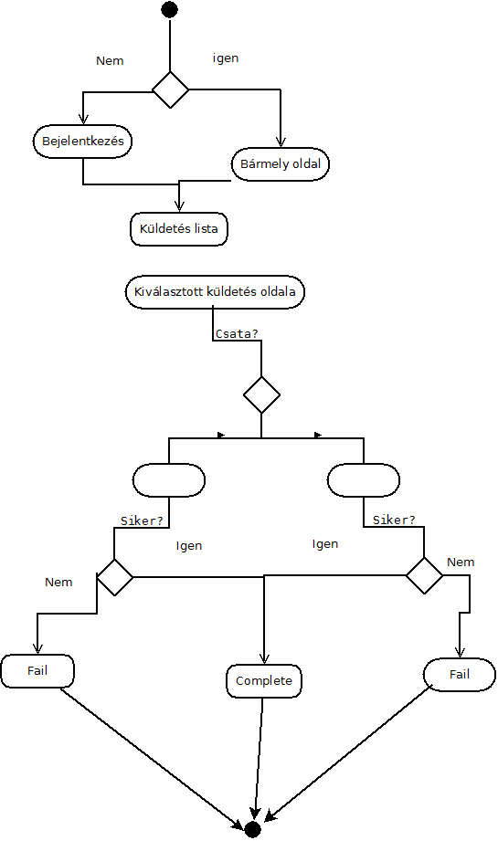

## 2. Tervezés

### 2.1 Oldaltérkép

#### Publikus
  - Főoldal
  - Klán részletek (tagjai, neve, fejlesztéseinek állapota)
  - Játékos adatai
#### Bejelentkezett Felhasználó (Klán nélküli)
  - Bolt 
  - Küldetések 
  - Játékos adatai 
    - Klán készítése
    - Csatlakozási kérelem küldése
    - Meghívó elfogadása (ha van)
#### Bejelentkezett Felhasználó (Klán)
  - Bolt 
  - Küldetések 
  - Játékos adatai 
    - Klán készítése
    - Csatlakozási kérelem küldése
    - Meghívó elfogadása (ha van)
  - Klán adatai
    - Adományozás
#### Bejelentkezett Felhasználó (Klán admin)
  - Klán adatai
    - Kirúgás
    - Meghívó küldése
    - Kérelmek elfogadása
#### Bejelentkezett Felhasználó(Klán készítő)
   - Klán adatai
     - Előfejlesztés

### 2.2 Végpontok:
 - GET/
   - /: Főoldal
   - /login: bejelntkező oldal 
   - /register: regisztrációs oldal 
   - /logout: kijelentkezés
   - /shop: bolt 
   - /quests: küldetések listája
   - /quests/:quest_id: `quest_id` küldetés mutatása
   - /quests/:quest_id/battle : A `quest_id`-hoz tartozó csata oldal megnyitása (kliens oldali rész kell még)
   - /create_clan: Klán készítése
   - /players/:user_name
     - /invites: meghívók elfogadásának az oldala
     - /ask: kérés küldő oldal
     - /details: `user_name` játékosnak a játékos adatlapjának a mutatása
   - /clans/:clan_name
     - /donation: adományozó oldal
     - /invite: meghívók küldésének az oldala
     - /requests: kérések elfogadásának oldala
     - /details: `clan_name` klánnak a részletes adatlapja
     - /kick: játékos eltávolításának oldala
     - /promote: játékos előléptetésének oldala
  
  - POST/
    - /clans/:clan_name
      - /details: clán adatainak lekérése
      - /donation : adományozás a céhnek
      - /invite : játékos meghívása céhbe
      - /requests : játékos csatlakozási kérelmének elfogadása
      - /kick : játékos kirúgása a céhből
      - /promote : játékos előléptetése vagy lefokozása a céhben
    - /players/:user_name
      - /details : tárgy eladása az eszköztárból
      - /invites : a meghívó céhbe való csatlakozás
      - /ask : csatlakozási kérelem elküldése
    - /login : Bejelentkezés
    - /create_clan : klán létrehozása
    - /register : Regisztráció az oldalra
    - /shop : tárgy vásárlása
    - /quests/quest_id : küldetés teljesítése

### 2.3 Felhasználó modell

**Felhasználó**

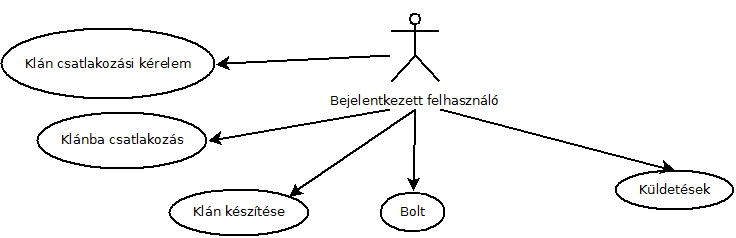

**Klán tag**

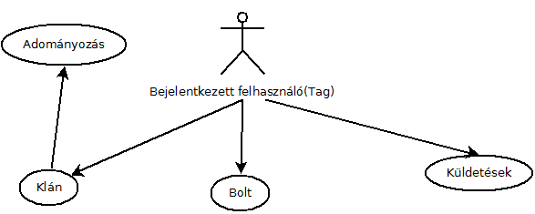

**Klán admin**

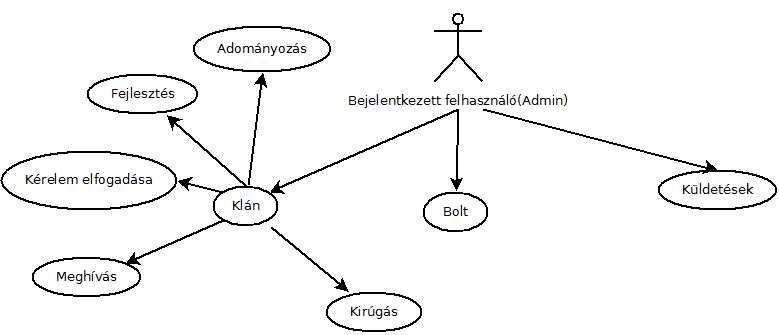

**Klán készítő**

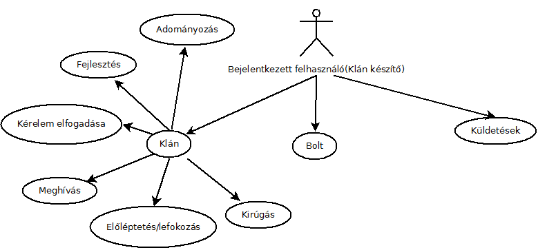

### 2.4 Mockup

**Készítőként klán oldal mockup**

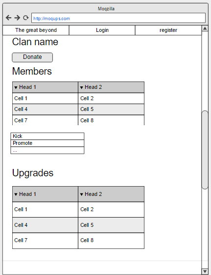

**Bejelentkezés mockup**

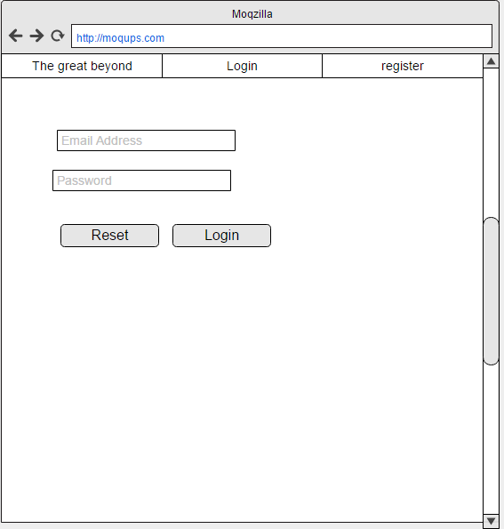

**Főoldal mockup**

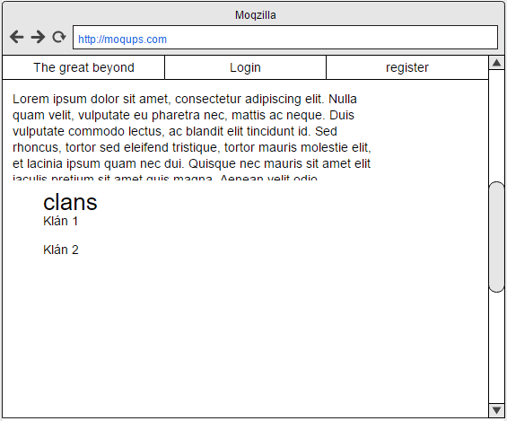

**Játékos adatlap mockup**

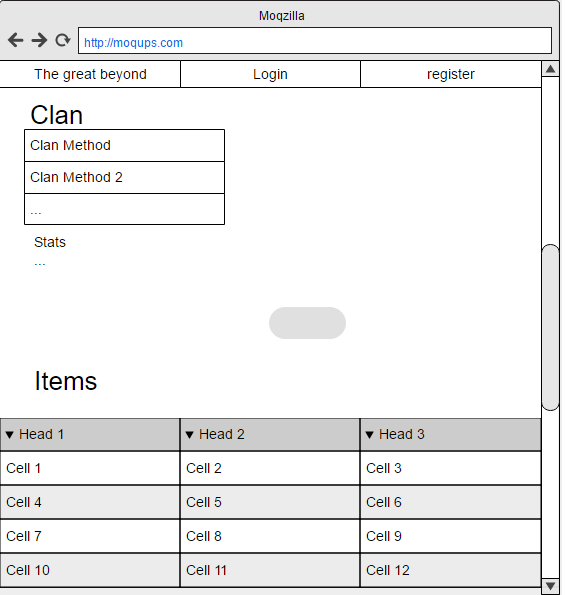

**Küldetés lista mockup**

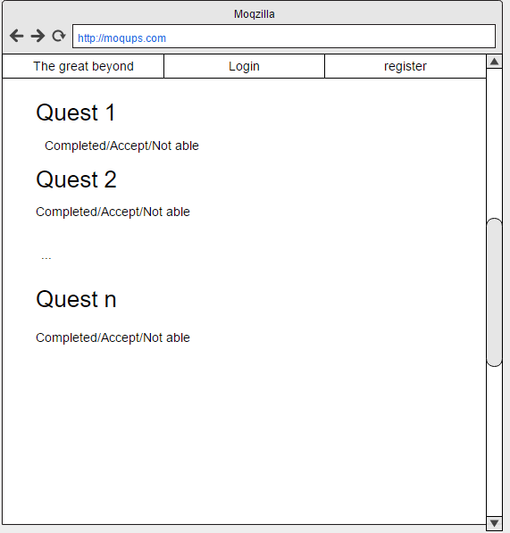

**Példa quest mockup**

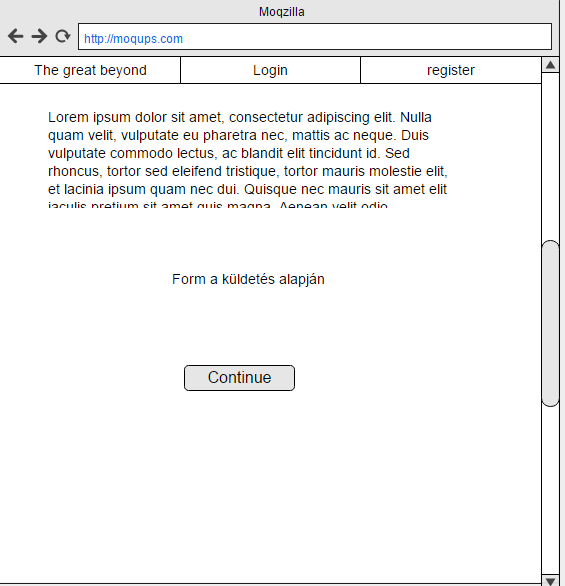

**Regisztráció mockup**

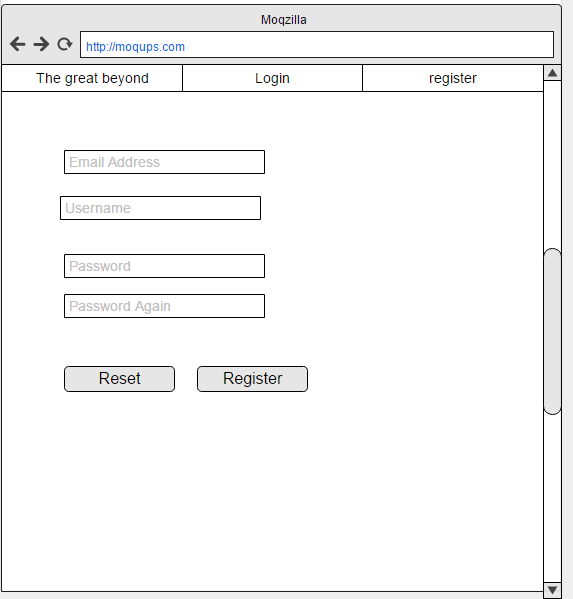

**Promote kick invite, shop mockup**

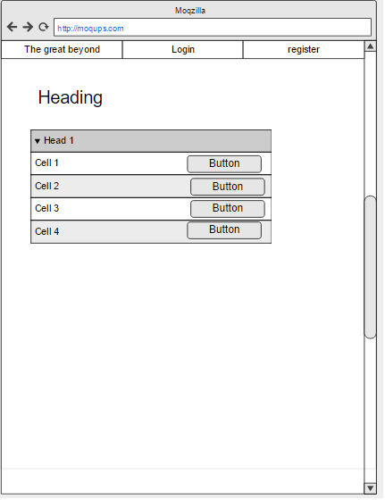

### 2.5 Megvalósítás

**Főoldal**
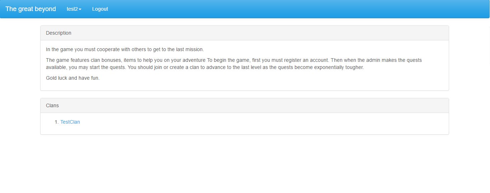

**Meghívás**
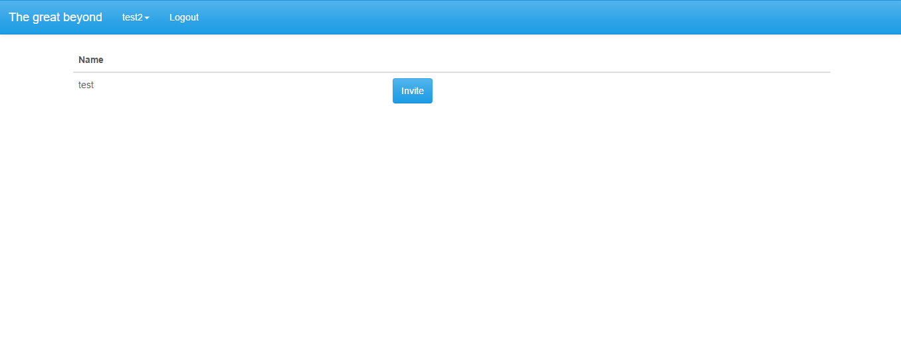

**Klán részletei készítőként**
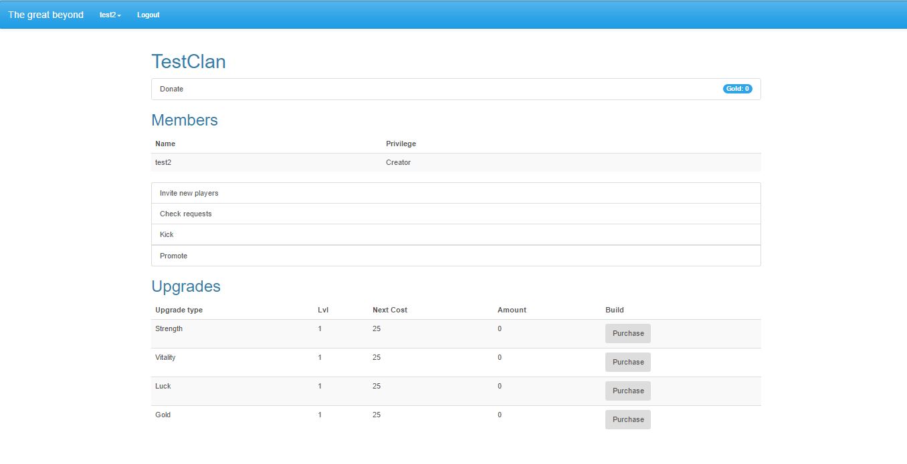

**Adományozás**
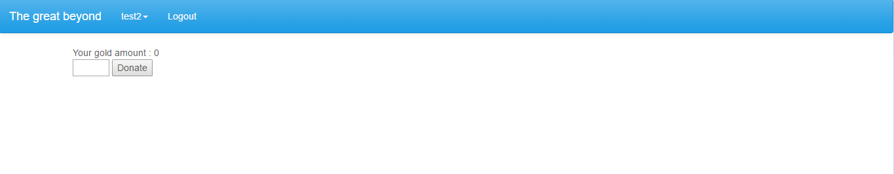

**Egy példa küldetés**
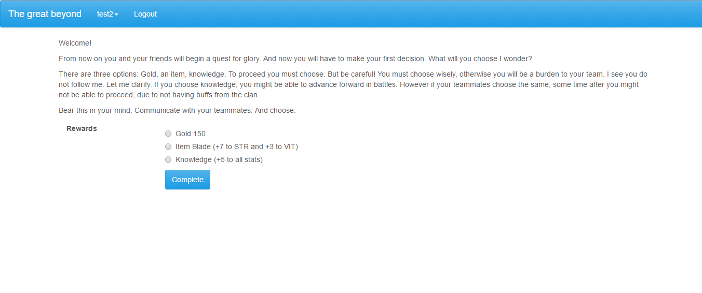

**Bejelentkezés**

**Játékos adatlapja**
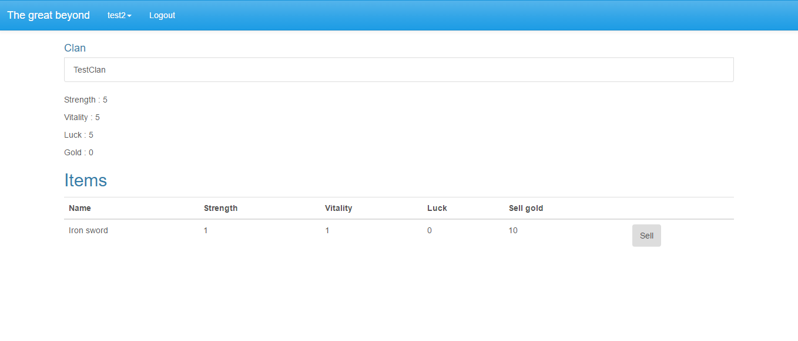

**Küldetések listája**
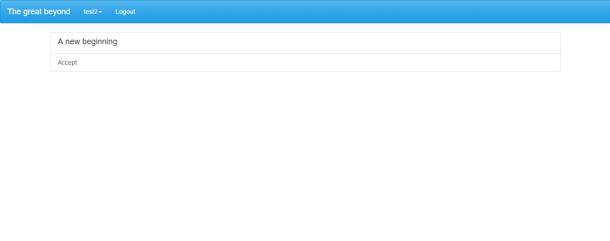

**Bolt felület**
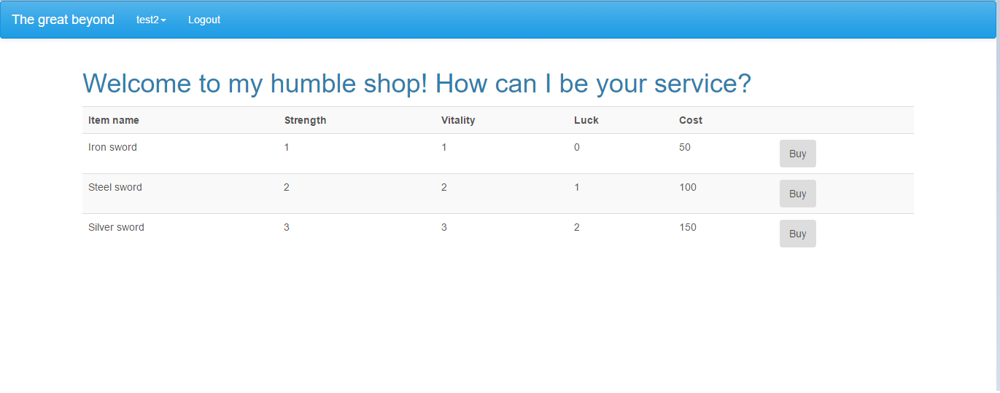

## 3. Implementáció

### 3.1 Adatbázisterv

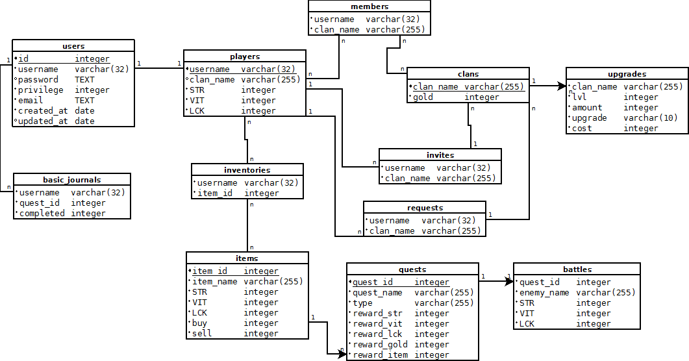

### 3.2 Fejlesztőkörnyezet

Lokális IDE: Visual Studio Code 
 - Github account nem szükséges, de hasznos
 - Hozzunk létre egy munkakönyvtárat
 - node.js-el töltsük le az adonisJS-t
 - adonissJS hozzuk létre a fejlesztő környezetet
 - Ezen a munkaterületen elkezdhetünk kódolni
 - Miután végeztünk a munkával elmenthetjük lokálisan vagy github-ra
 - Githubra először a Visual Studio-n belül a Stage All-al kijelöljük a pusholni kívánt 
 fájlokat majd commit-áljuk őket. Ezután a Push paranccsal föltölthetjük a github accountunkra

### 3.3 Könyvtárstruktúra
- Controllers
  - ClanController.js
  - ItemController.js
  - PlayerController.js
  - QuestController.js
  - UpgradeController.js
  - UserController.js

- Models
  - BasicJournal.js
  - Clan.js
  - Hooks
  - Inventory.js
  - Item.js
  - Member.js  
  - Player.js
  - Quest.js
  - Token.js
  - Upgrade.js
  - User.js
- Migrations
  - 1476890630864_create_users_table.js
  - 1476890630865_create_tokens_table.js
  - 1476890776416_clans.js
  - 1479026035787_players.js
  - 1479026049180_items.js
  - 1479026057849_quests.js
  - 1479036276167_basic_journals.js
  - 1479037149688_inventories.js
  - 1479058984745_upgrades.js
  - 1479212234298_members.js
  - 1480193661488_invites.js
  - 1480240245051_requests.js
  - 1480268487520_battles.js
- Views
  - askForInvite.njk
  - clan.njk
  - createClan.njk
  - donation.njk
  - invite.njk
  - inviteRequests.njk
  - kick.njk
  - layout.njk
  - listInvites.njk
  - login.njk
  - main.njk
  - master.njk
  - player.njk
  - promote.njk
  - questList.njk
  - quests
  - register.njk
  - shop.njk
  - welcome.njk
- server.js

## 4. **3. Beadandóhoz**

### Szekvenciadiagram
A szekvencia diagram egy felhasználó regisztrálását és azon belül is egy új klán létrehozását illuszrtrálja.
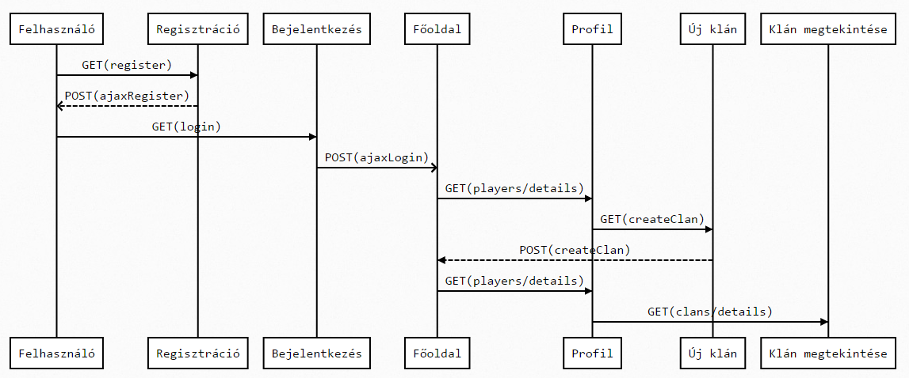

### 4.1 Funkciók
 - donate.js
   * `donateGold()` : A funkció kiírja, hogy az adományozott érték után mennyi pénz marad a játékosnak.
    A funkció akkor fut le mikor beírunk valamit a **donate** oldalon lévő mezőbe
 - login.js 
   * `loginOrRegister(e, which)` : Az `e` paraméter a kiváltott eventből jön. 
   A `which` egy string mely vagy **login** vagy **register**. 
   A `which` - től függően változik a modal működése. A `form` elküldésekor fut le
   * `sendData(e, where, $error, $modal)`: AJAX-al elküldi az adatokat vagy a **register**-hez vagy **login**-hoz a `where`-től függően. A `form` elküldésekor fut le
 - shop.js
   * `ajaxShop(e)` : AJAX segítségével elküldjük az adatokat a szervernek, hogy mely tárgyat szeretnénk kérni. 
   Ezt a választ a `<h1>`-be kapjuk vissza mintha az eladó mondaná a problémát, vagy sikeres tranzakciót
 - clanMainPage.js
    * `ajaxUpgrade(e)` : AJAX segítségével elküldjük az adatokat a szervernek, hogy melyik fejlesztést akarjuk megvásárolni.
    * `disablePurchase()` : Ellenőrzi, hogy mennyi pénze van a céhnek és atttól függően letiltja a vásárlást a különböző fejlesztésekre. A **Buy** gomb lenyomásakor fut le 
 - battleScript.js
   * `battle(e)` : A harcért felelős fő funkció. Kiszámolja ki kezd egy érmeföldobással, és aszerint kezdi meg a játékot. Az oldalon lévő **Battle** gombbal fut le ez a funkció.
   * `attack(who)` : A `who` paraméterben megadjuk, hogy ki támad kit. Ez a funkció kiszámolja, a sebzést és visszaadja a végén. 
   A funkció random generál egy `dodge` és egy `lucky` változót. A `lucky` ha kisebb mint a `who` szerencséje és a `dodge` nem a kétszerese a `lucky`-nak akkor kritikus csapás történik azaz a sebzés a kétszerese lesz.
   Ha a `dodge` legalább négyszerese a `lucky`-nak akkor a sebzés 0 lesz. Ha egyik sem sikerül akkor egy szimpla támadás történik.   
   * `sendData(e, $modal)`: AJAX segítségével elküldjük a szervernek hogy milyen ajándékot választottunk.
   * `rewardModal(e)`: Megjeleníti a választható díjakat egy modal dialogús ablakban   
   * `equip(e)`: Frissíti az adatokat a játékos adatlapján aszerint melyik fegyvert választjuk. Ha elkezdődött a harc, akkor az életerőt már nem lehet módosítani

### 4.2 Újítások szerveroldalon
 - Egy elvégzett küldetésbe nem lehet visszamenni ha beírjuk a keresősávba a szükséges adatokat (QuestController)
 - Harc implementálva JavaScripttel (QuestController.battle, battle.njk)
 - Ajaxos funkciók névszerint: `ajaxRegister`, `ajaxLogin`, `ajaxComplete`, `ajaxBuy`, `ajaxPurchase` (UserController, QuestController, UpgradeController, ItemController)
## 5. Tesztelés
### 5.1 Selenium IDE Telepítése:
0. Szükséges a Mozilla Firefox Telepítése
1. Klikkeljünk az **Add to Firefox** gomb-ra
2. Klikkeljünk a telepítésre.
3. Klikkeljünk az újraindításra.

Ellenőrízzük hogy látható a telepített **Selenium IDE** ikon. Ha nem akkor:
1. Klikkeljünk a menüre azonbelül a testreszabásra, ahol látható lesz a **Selenium IDE**
2. Fogjuk meg és tobjuk bele az eszköztárba a **Selenium IDE**-t

Ha ez nem működik akkor:
- Klikkeljünk a menüre és kapcsoljuk be a fejlesztői módot

### 5.2 Teszteléshez felhasználók 
 - E-mail: test@test.com, jelszó: test
 - E-mail: test2@test.com, jelszó: test
 - E-mail: test3@test.com, jelszó: test
 - E-mail: test4@test.com, jelszó: test

### 5.3 Selenium IDE-vel tesztelés

A teszteket a **test@test.com** felhasználóval lehet alapból végrehajtani és szükséges a **test4@test.com** felhasználó a léptetésekhez. Ezeket az adatbázisban alapból beállítottam.
Továbbá az adományozáshoz és a kard vásárláshoz szükséges hogy elegendő pénzmennyiség legyen. Ezeket az adatbázisban lehet módosítgatni, illetve küldetés gyors végrehajtásával szerezni.
A fájlokat a **tests** mappában találjuk.

 1. Bejelentkezés
    * Helyes adatokkal (TestSuite: login)
    * Helytelenül (TestSuite: loginFail)
 2. Adományozás (TestSuite: donate) (alapból elég legalább 1 arany)
 3. Egy vas kard vásárlása (alapból 50 arany kell hozzá)
    * Már van egy az eszköztárban (TestSuite: shop)
    * Még nincs az eszköztárban (TestSuite: shopNew)
 4. Előléptetés/lefokozás (test4-et a TestClan2-ből)
    * Elő (TestSuite: promote)
    * Le (Testsuite: demote)

Végeredményben mindegyiknek a végén hiba nélkül kell lefutnia. És ilyet kell látnunk

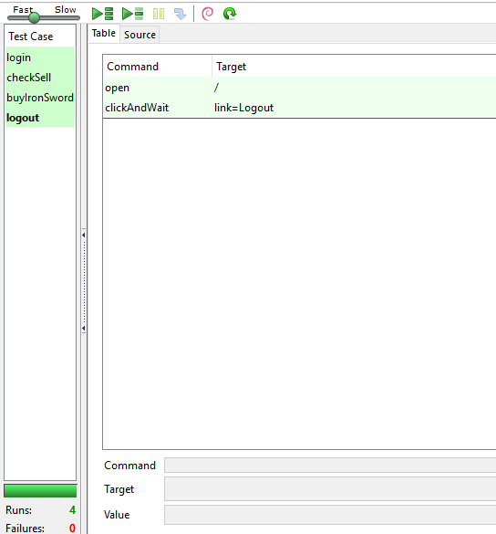

## 6. Felhasználói dokumentáció

### 6.1 Ajánlott követelmények 
A program bármilyen operációs rendszeren futtatható. Javascript szükséges a harc típusú küldetésekhez

### 6.2 Telepítés 
#### Telepítés előtt pár szükséges lépés
  - Kegy NodeJS és az npm amit itt lehet letölteni : [www.npmjs.com/get-npm](https://)
  - Internet elérés

#### Telepítés
1. Látogasson el a 	[github.com/Telmike91/alkfejlszerver](https://) oldalra
2. Itt kattintson a **"Clone and Download"** gombra, és azon belül kattintson a **"Download as Zip"** gombra.
3. A letöltött állományt csomagoljuk ki
4. **npm i** parancsot adjuk ki parancssorban a kicsomagolt állomány mappájában.
5. **.env.example**-t nevezzük át **.env**-re és állítsuk be tetszés szerint 
6. **npm start**-al elindíthatjuk a programot (Allapesetben localhost:3333-on fut a program)

### 6.3 Használata
1. Böngészőben a keresősávba írjuk be az **.env** fájlban megadott elérést. (Alapeset: localhost:3333)
2. Regisztrálás és bejelentkezés után használhatjuk a programot.